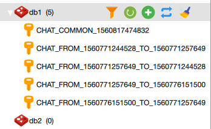
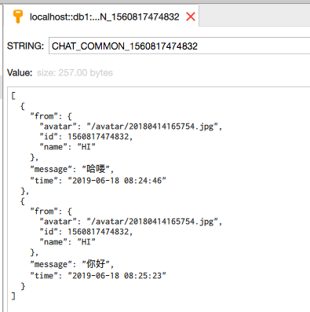
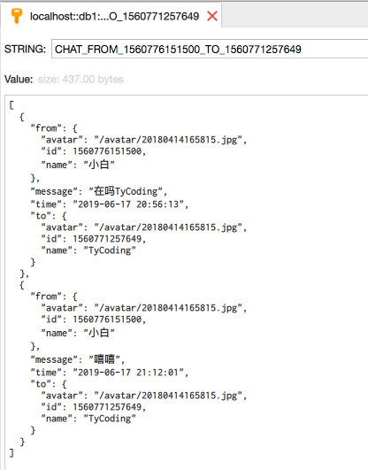

# 基于WebSocket的在线聊天系统 -- Redis会话消息储存

 <p align="center">
  <a href="https://github.com/TyCoding/boot-chat/" target="_blank">
    
  </a>
  
  
  
 </p>
 
**线上地址**

[Chat](http://39.105.46.235:8087/)

## 介绍

基于SpringBoot-2.1.5、SpringBoot-Starter-Websocket构建，前端使用Vue.js、ElementUI框架。

实现了：

* HttpSession消息储存
* 单窗口消息推送
* 群发消息推送
* 上线提醒
* 实时刷新用户列表、消息列表

找 *虫子* 无聊之余，可以来耍一耍！

## 特点

本版使用了Redis储存WebSocket会话消息和登录用户数据，因此解决了上一版中HttpSession储存会话消息导致会话数据丢失的问题。

同样使用了一些前缀标识区分不同用户的会话内容：

```java
public interface CommonConstant {

    /**
     * 用户数据 Key前缀标识
     */
    String USER_PREFIX = "USER_";

    /**
     * 群发消息Session Key前缀标识
     */
    String CHAT_COMMON_PREFIX = "CHAT_COMMON_";

    /**
     * 推送至指定用户消息
     *      推送方Session Key前缀标识
     */
    String CHAT_FROM_PREFIX = "CHAT_FROM_";

    /**
     * 推送至指定用户消息
     *      接收方Session Key前缀标识
     */
    String CHAT_TO_PREFIX = "_TO_";

    /**
     * RedisTemplate 根据Key模糊匹配查询前缀
     */
    String REDIS_MATCH_PREFIX = "*";
}
```

可以看下Redis中储存的数据结构和内容：







## 定时任务

因为功能限制，并没有使用Mysql数据库储存用户数据，用户的ID即为登录时的时间戳，数据保存在Redis中，但可以使用定时任务实现登录用户数据、会话消息的定时删除：

```java
@Slf4j
@Component
@Configuration
@EnableScheduling
public class ScheduleTaskConfig {
    private static final Long MINUTE_30 = 1000 * 60 * 30L;

    @Autowired
    private StringRedisTemplate redisTemplate;

    @Autowired
    private ChatSessionService chatSessionService;

    @Scheduled(cron = "0 */30 * * * ?")
    private void clearUser() {
        log.info("定时任务 >>>>>>>>>> 清除注册时间超过30分钟的账户，以及其会话信息");

        List<User> userList = chatSessionService.onlineList();
        userList.forEach(user -> {
            if ((new Date().getTime() - user.getId()) >= MINUTE_30) {
                chatSessionService.delete(user.getId().toString());
                if (redisTemplate.boundValueOps(CommonConstant.CHAT_COMMON_PREFIX + user.getId()).get() != null) {
                    redisTemplate.delete(CommonConstant.CHAT_COMMON_PREFIX + user.getId());
                }
                if (redisTemplate.boundValueOps(CommonConstant.CHAT_FROM_PREFIX + user.getId()).get() != null) {
                    redisTemplate.delete(CommonConstant.CHAT_FROM_PREFIX + user.getId());
                }
            }
        });
    }
}
```

## 运行&&部署

* 启动本地Redis
* 修改`application.yml`中Redis链接信息
* 保证浏览器访问URL与`api.js`中WebSocket的链接IP一致（如果是localhost就都改为localhost）

```
# 运行

$ git clone https://github.com/TyCoding/boot-chat
# use idea & eclipse run

# 部署

$ mvn clean package
$ cd taget
$ java -jar boot-chat-0.0.1-SNAPSHOT.jar
```

Access http://localhost:8080 using Chrome
